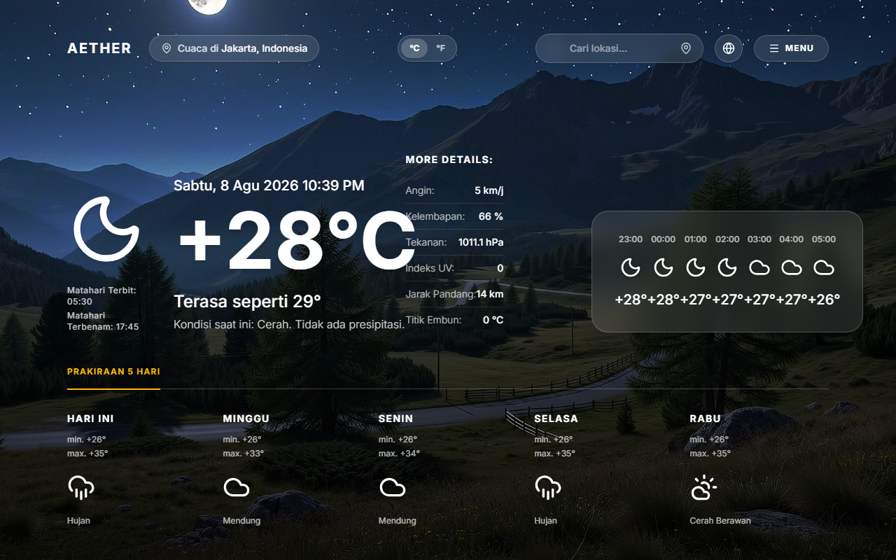

# 🌤️ Aether Weather App



Aether adalah aplikasi cuaca modern, premium, dan interaktif yang dibangun dengan desain antarmuka berbasis **Glassmorphism**. Menawarkan pembaruan cuaca seketika (*real-time*), perkiraan per jam dan 5 hari ke depan, serta dukungan dwibahasa (Bilingual).

## ✨ Fitur Utama (Features)

- **Real-Time Data**: Menggunakan API satelit dari Open-Meteo untuk data cuaca langsung yang sangat presisi (tanpa API Key).
- **Desain Glassmorphism**: Estetika modern menggunakan material transparan seperti kaca berembun yang menyatu dengan latar belakang dinamis.
- **Dynamic Video Background**: Latar belakang aplikasi berubah secara dinamis berupa video *loop* transisi mulus (ping-pong) sesuai dengan kondisi cuaca dan waktu (Siang/Sore/Malam).
- **Auto Geolocation**: Melacak cuaca di lokasi Anda berdiri saat ini dengan sekali klik melalui navigasi GPS bawaan (*Reverse Geocoding* via BigDataCloud).
- **Sistem Bilingual (i18n)**: Beralih instan antara **Bahasa Indonesia (ID)** dan **English (EN)** melalui *dropdown menu* yang elegan di bilah navigasi (tersimpan otomatis di `localStorage`).
- **Lokasi Favorit**: Simpan daftar lokasi favorit Anda dan akses dengan cepat melalui *Sidebar*.
- **Jam Real-Time**: Tampilan jam kota tujuan berdetak secara *real-time* menyesuaikan zona waktunya (*timezone*).

## 🛠️ Teknologi yang Digunakan (Tech Stack)

- **React (Vite)**: Kerangka kerja utama antarmuka pengguna.
- **Tailwind CSS v4**: *Styling* utilitas penuh dengan kemudahan penyesuaian (*customization*).
- **Lucide React**: Kumpulan ikon minimalis nan cantik.
- **Open-Meteo API**: Penyedia data cuaca gratis dan komprehensif.

## 🚀 Cara Menjalankan Secara Lokal (How to Run)

1. Pastikan Anda memiliki **Node.js** terinstal.
2. Clone repository ini:
   ```bash
   git clone https://github.com/boyharendy/Aether---Weather-web.git
   ```
3. Pindah ke direktori proyek:
   ```bash
   cd Aether---Weather-web
   ```
4. Instal dependensi:
   ```bash
   npm install
   ```
5. Jalankan server pengembangan:
   ```bash
   npm run dev
   ```
6. Buka URL yang tertera di terminal Anda (biasanya `http://localhost:5173`).

---
Dibuat dengan ❤️ oleh Boyharendy.
