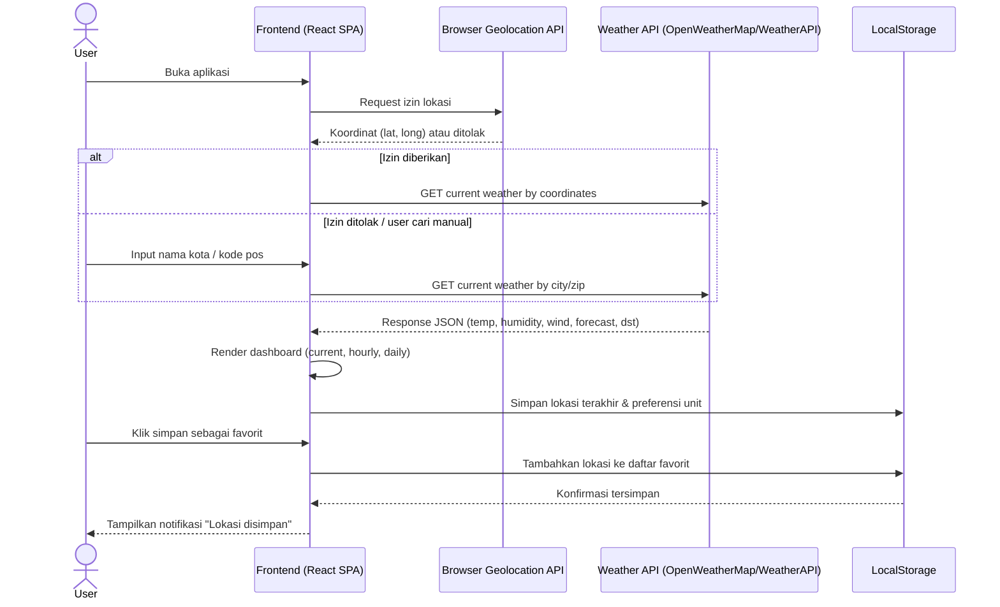
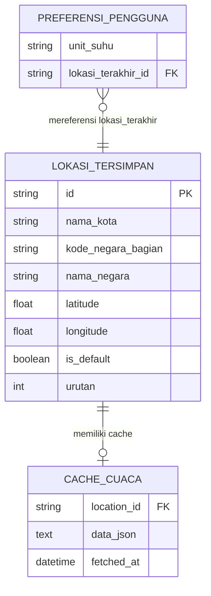

# PRD: Weather Dashboard App

## 1. **Overview**

Weather Dashboard App adalah *web app* client-side untuk menampilkan informasi cuaca real-time secara visual dan cepat diakses dari browser mana pun tanpa perlu instalasi. Target penggunanya adalah pengguna umum yang ingin cek cuaca harian dengan tampilan menarik, sekaligus cocok dijadikan project pembelajaran bagi developer pemula yang ingin belajar integrasi *REST API*. Model bisnisnya B2C, gratis, dan tanpa sistem akun — murni *utility app* publik.

**Masalah yang diselesaikan:** saat ini pengguna harus berpindah-pindah antara Google search, app cuaca bawaan HP, atau situs BMKG untuk cek cuaca, dengan tampilan yang sering penuh iklan dan sulit dibaca cepat. Tidak ada cara mudah untuk menyimpan beberapa kota favorit (misal kota tempat tinggal dan kota keluarga) tanpa harus install *native app* dan memberi izin lokasi permanen ke pihak ketiga.

**Tujuan Utama:** dari sisi *end-user*, aplikasi ini memberi *dashboard* cuaca yang cepat diakses dari browser mana pun, tampilan visual menarik dengan *background* foto yang berubah dinamis mengikuti kondisi cuaca, serta kemampuan menyimpan beberapa lokasi favorit untuk *switching* cepat antar kota. Dari sisi pengembang/pemilik produk, tujuannya adalah membangun aplikasi ringan tanpa biaya infrastruktur backend — karena seluruh data personal (preferensi, lokasi favorit) tersimpan di browser pengguna sendiri lewat *LocalStorage*, sehingga aplikasi scalable secara gratis dan mudah di-*maintain*.

## 2. **Requirements**

- **Arsitektur Client-Side Murni (SPA):** seluruh aplikasi berjalan di browser tanpa backend server sendiri; data cuaca diambil langsung dari *REST API* pihak ketiga saat runtime.
- **Integrasi Weather API Pihak Ketiga:** gunakan *OpenWeatherMap* atau *WeatherAPI* sebagai sumber data *current weather*, *hourly forecast*, dan *daily forecast*; API key dikelola lewat *environment variable* saat build, bukan di-*hardcode* di kode publik.
- **Persistensi Data via LocalStorage:** lokasi favorit, preferensi satuan suhu, dan lokasi terakhir dicari disimpan di *LocalStorage* browser, tanpa kebutuhan akun/login.
- **Akses Publik Tanpa Autentikasi:** semua fitur bisa langsung dipakai tanpa registrasi karena data bersifat personal-per-browser (bukan lintas device).
- **Error Handling API:** sistem wajib menangani kegagalan *fetch* (nama kota tidak ditemukan, API down, *rate limit* habis) dengan pesan error jelas ke user, bukan layar kosong/*crash*.
- **Penanganan Izin Geolocation:** *request* izin lokasi browser dengan *graceful fallback* ke pencarian manual kalau user menolak izin atau device tidak mendukung *geolocation*.
- **Mobile-First & Responsive:** grid metric dan card forecast harus reflow rapi di layar kecil (HP), karena mayoritas user cek cuaca dari browser mobile.
- **Cache Sementara untuk Efisiensi API Call:** simpan hasil *fetch* terakhir per lokasi dengan *TTL* singkat (misal 10 menit) di localStorage untuk mengurangi jumlah panggilan API berulang saat user gonta-ganti tab dalam waktu dekat.
- **Ekstensibilitas Modular:** struktur kode memisahkan modul *fetching* data cuaca dari komponen UI, supaya mudah menambah fitur lanjutan di iterasi berikutnya seperti *air quality index*, *sunrise/sunset time*, *weather alerts*, atau *outfit suggestion*.

## 3. **Core Features**

- **Pencarian & Deteksi Lokasi:** cari cuaca berdasarkan nama kota atau kode pos lewat *search bar*, atau biarkan sistem *auto-detect* lokasi user via *Geolocation API* saat pertama kali membuka app.
- **Dashboard Cuaca Saat Ini:** tampilkan suhu real-time (dengan *toggle* °C/°F), kondisi cuaca (ikon + label seperti "Haze"), waktu & tanggal lokal, serta metric detail (*humidity*, *pressure*, *visibility*, *wind speed*, *UV index*, *dew point*) dalam grid card sesuai referensi desain.
- **Prakiraan Per Jam (Hourly Forecast):** tampilkan prakiraan 24 jam ke depan dalam *scroll* horizontal, ter-*update* tiap kali ada *fetch* data baru.
- **Prakiraan 5 Hari (Daily Forecast):** ringkasan suhu tertinggi/terendah & kondisi cuaca untuk 5 hari ke depan, ditambah breakdown Morning/Afternoon/Evening seperti card "Today's" pada referensi desain.
- **Simpan Lokasi Favorit:** user bisa menyimpan banyak kota ke daftar favorit via *LocalStorage*, dan berpindah antar kota tersimpan dalam satu klik tanpa perlu *search* ulang.
- **Background Dinamis Berdasarkan Cuaca:** *hero background image*/*gradient* berubah otomatis mengikuti kondisi cuaca real-time (cerah, mendung, hujan, malam hari, dst) untuk memperkuat kesan visual sesuai mockup.

## 4. **User Flow**

**Flow A — Pengguna Baru (First-Time Visitor)**
1. Membuka aplikasi weather dashboard di browser.
2. Browser menampilkan *prompt* izin lokasi (*Geolocation API*).
3. Jika izin diberikan: sistem otomatis mengambil koordinat GPS, mengirim *request* ke Weather API, lalu menampilkan cuaca kota terdekat sesuai koordinat.
4. Jika izin ditolak: sistem menampilkan state kosong/kota default dan meminta user mencari lokasi secara manual.
5. User mengetik nama kota atau kode pos di *search bar* lalu menekan enter/klik cari.
6. Sistem memvalidasi input, memanggil Weather API, dan menampilkan *loading state* sementara menunggu response.
7. Sistem menampilkan dashboard lengkap: suhu saat ini, kondisi, waktu lokal, *background* dinamis sesuai cuaca, grid metric (humidity, pressure, visibility, wind, UV index, dew point), dan card Morning/Afternoon/Evening.
8. User mengklik tab "Hourly Forecast" atau "Daily Forecast" untuk melihat prakiraan lebih lanjut; sistem me-*render* data forecast dari response yang sama.
9. User mengklik tombol "Change Location" lalu memilih "Simpan sebagai favorit"; sistem menyimpan entry lokasi baru ke *LocalStorage*.

**Flow B — Pengguna dengan Lokasi Tersimpan (Returning User)**
1. Membuka aplikasi; sistem membaca *LocalStorage* untuk mengecek apakah ada lokasi favorit/terakhir dicari.
2. Jika ada, sistem langsung *fetch* data cuaca terbaru untuk lokasi terakhir tanpa perlu *request* izin geolocation ulang.
3. Sistem menampilkan dashboard dengan data lokasi tersebut sebagai tampilan default.
4. User membuka panel "Change Location" dan melihat daftar lokasi favorit yang tersimpan.
5. User mengklik salah satu kota favorit dari daftar; sistem *fetch* data cuaca baru untuk kota tersebut dan meng-*update* seluruh dashboard (termasuk *background*).
6. User dapat menghapus lokasi favorit dari daftar (klik ikon hapus); sistem meng-*update* *LocalStorage*.
7. User mengganti satuan suhu (°C/°F) lewat *toggle*; sistem meng-*update* tampilan dan menyimpan preferensi ini ke *LocalStorage* untuk sesi berikutnya.

## 5. **Architecture**

Karena aplikasi ini tidak butuh data lintas-device atau sistem akun, arsitektur yang dipilih adalah *Single Page Application* (SPA) berbasis **React + Vite**, murni *client-side* tanpa backend server sendiri. React dipilih agar komponen seperti *search bar*, *metric card*, dan *forecast card* bisa dibuat *reusable* dan mudah di-*maintain*, sementara Vite dipilih sebagai *build tool* karena ringan dan cepat untuk tahap MVP — dibanding *framework* full-stack seperti Next.js yang tidak diperlukan di sini karena tidak ada *server-side rendering* atau *API route* backend. Semua data cuaca didapat langsung dari pemanggilan *Weather API* pihak ketiga di browser, dan seluruh data personal (lokasi favorit, preferensi) disimpan di *LocalStorage* milik browser user — jadi tidak ada isolasi data multitenant yang perlu ditangani di sisi server, karena tiap browser secara otomatis terisolasi satu sama lain.

## 6. **Database Schema**

Karena aplikasi ini tidak memakai database server, "skema" di bawah merepresentasikan struktur data yang disimpan di *LocalStorage* browser sebagai pengganti database tradisional. Relasi utamanya: satu `Preferensi Pengguna` mereferensi satu `Lokasi Tersimpan` sebagai lokasi default, dan tiap `Lokasi Tersimpan` bisa punya satu `Cache Data Cuaca` untuk mengurangi panggilan API berulang.

1. **`Lokasi Tersimpan (SavedLocation)` - daftar kota favorit milik user, disimpan sebagai array di key `weatherapp_saved_locations`**
   - `id` (String, *Primary Key*): identifier unik, digenerate dari kombinasi latitude+longitude atau nama kota+kode negara.
   - `nama_kota` (String): nama kota, contoh "Los Angeles".
   - `kode_negara_bagian` (String): kode provinsi/negara bagian, contoh "CA" (opsional).
   - `nama_negara` (String): nama negara, contoh "United States".
   - `latitude` (Float): koordinat lintang untuk pemanggilan API.
   - `longitude` (Float): koordinat bujur untuk pemanggilan API.
   - `is_default` (Boolean): flag apakah lokasi ini yang ditampilkan saat app pertama kali dibuka.
   - `urutan` (Integer): urutan tampil di daftar lokasi favorit.

2. **`Cache Data Cuaca (WeatherCache)` - hasil fetch terakhir per lokasi, disimpan di key `weathercache_{location_id}`**
   - `location_id` (String, *Foreign Key* ke `SavedLocation.id`, boleh juga menyimpan hasil pencarian ad-hoc yang belum di-*favorite*-kan).
   - `data_json` (Text/JSON): raw response cuaca terakhir (current, hourly, daily) dari Weather API.
   - `fetched_at` (Datetime): timestamp kapan data diambil, dipakai untuk logika *TTL cache* (misal 10 menit) sebelum data di-*fetch* ulang.

3. **`Preferensi Pengguna (UserPreference)` - satu objek tunggal per browser, disimpan di key `weatherapp_preference`**
   - `unit_suhu` (String): `"celsius"` atau `"fahrenheit"`, preferensi satuan suhu default.
   - `lokasi_terakhir_id` (String, *Foreign Key* ke `SavedLocation.id`): referensi ke lokasi terakhir yang ditampilkan user.

## 7. **Tech Stack**

- **Framework Fullstack:** **React (Vite)** — dipilih karena butuh komponen *reusable* (search bar, forecast card, metric card) dan *dev experience* cepat; karena aplikasi ini murni *client-side* tanpa backend/SSR, Vite lebih ringan dibanding Next.js untuk tahap MVP.
- **Styling/UI:** tailwind css
- **Database:** **Browser LocalStorage** — karena aplikasi tidak butuh data lintas-device atau akun, LocalStorage cukup untuk menyimpan preferensi & lokasi favorit tanpa biaya infrastruktur backend, sesuai kebutuhan tahap MVP.
- **ORM:** **Tidak diperlukan** — tidak ada database server; akses data langsung lewat *Web Storage API* native browser.
- **Autentikasi:** **Tidak diperlukan untuk MVP** — aplikasi publik tanpa login, data personal tersimpan lokal per-browser; autentikasi bisa ditambahkan di iterasi berikutnya kalau nanti butuh sinkronisasi lintas device.
- **Deployment:** **Vercel** (atau Netlify) — *static hosting* dengan *auto-deploy* dari Git, gratis untuk tahap MVP, cocok untuk aplikasi *client-side-only*.
- **Integrasi Eksternal:** **OpenWeatherMap API atau WeatherAPI** sebagai sumber data *current weather*, *hourly*, dan *daily forecast*; ditambah **Browser Geolocation API** untuk deteksi lokasi otomatis.
